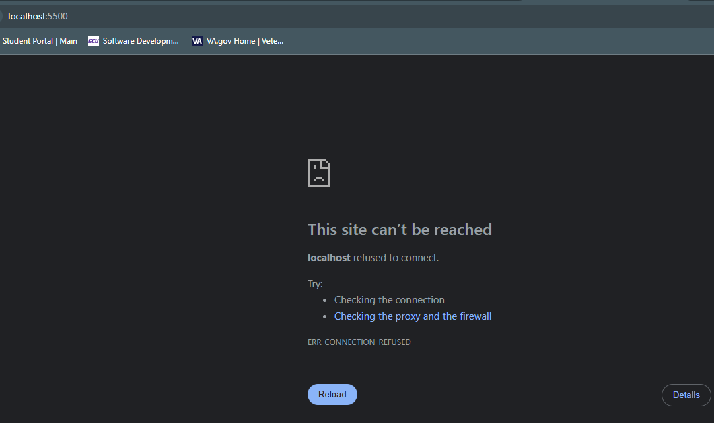

# CST339 - Activity 1 - Introduction to Spring Boot

## Part 1: Tools Installation and Validation

### Screenshots

- Screenshot of the proof of Spring Boot installation

     

- Screenshot of the console output

    

- Screenshot of the error page

    

- Screenshot of the Hello World index.html page

    

## Part 2: Learning Maven

### Screenshots

