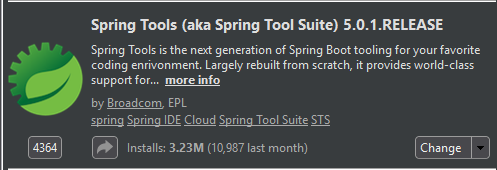
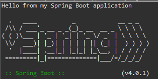
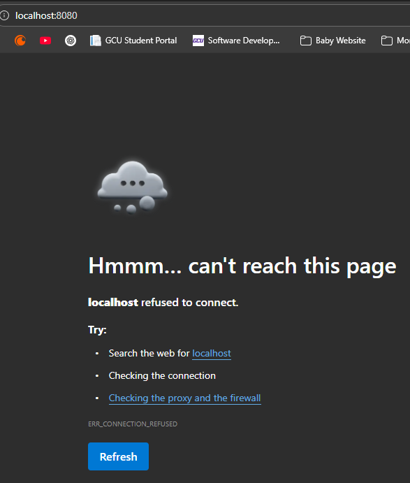
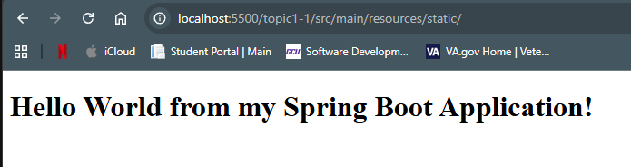
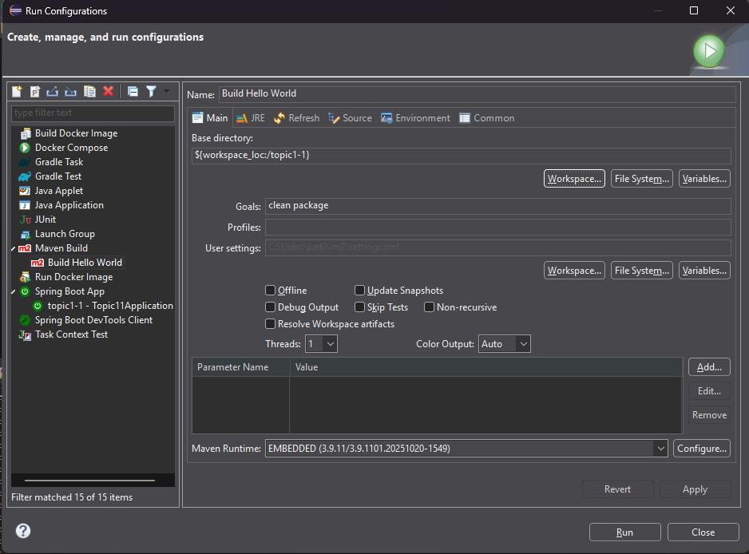
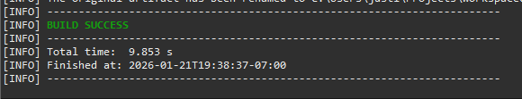
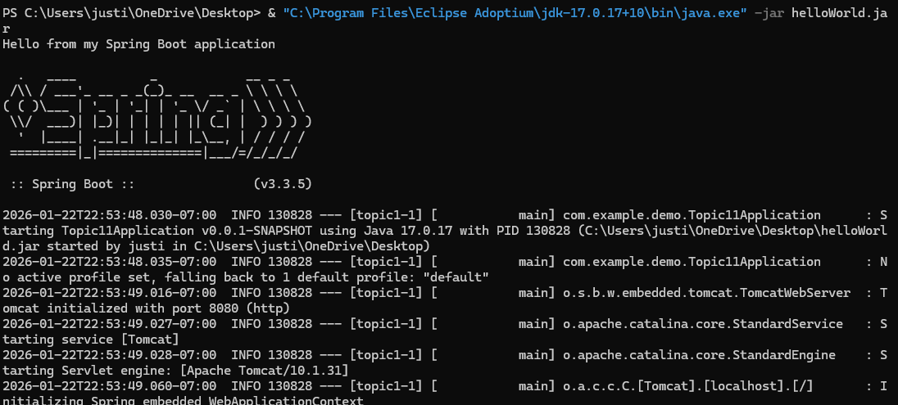
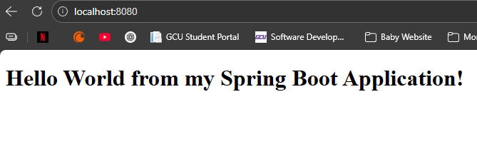

# CST339 - Activity 1 - Introduction to Spring Boot
Justin Albecker

1/25/2026

## Part 1: Tools Installation and Validation

### Screenshots

- Screenshot of the proof of Spring Boot installation

     

- Screenshot of the console output

    

- Screenshot of the error page

    

- Screenshot of the Hello World index.html page

    

## Part 2: Learning Maven

### Screenshots

- Screenshot of the Maven Build configurations

    

- Screenshot of the Maven Console, with the "BUILD SUCCESS" message.
    

- Screenshots of the JAR file execution.
    

    

