# Activity 2 - Spring Model View Controller (MVC)
CST-339: Java III  
Justin Albecker  
1/25/2026

## Part 1: Creating Models, Views, and Controllers Using Spring MVC

### Screenshots
- Screenshot of the first MVC test screen

    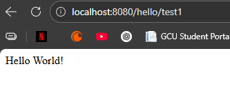

- Screenshot of the second MVC test screen

    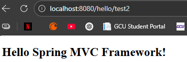
   
- Screenshot of the third MVC test screen

    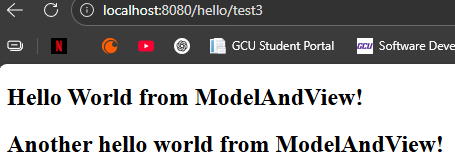

- Screenshot of the fourth MVC test screen

    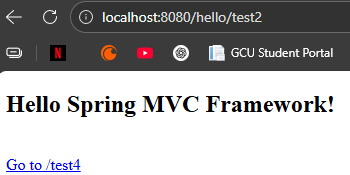

- Screenshot of the fifth MVC test screen

    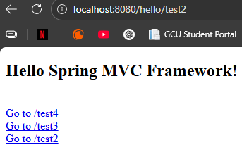

- Screenshot of the sixth MVC test screen

    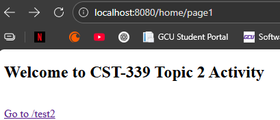

    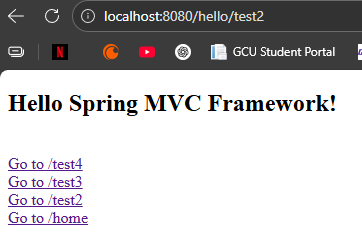

- Screenshot of the JAR file test

     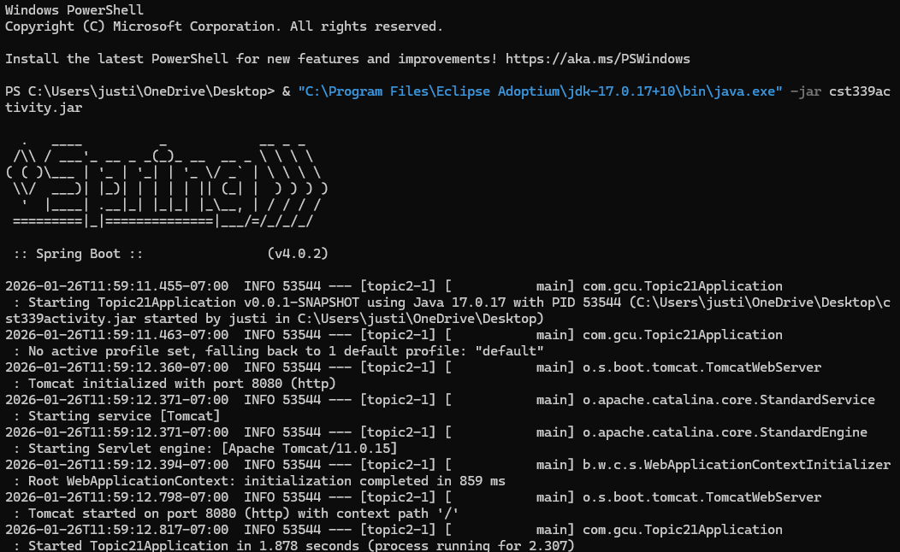

## Part 2: Creating Forms with Data Validation Using Spring MVC

### Screenshots

- Screenshot of the Login Form with no data validation

    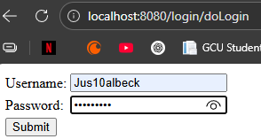

- Screenshot of the table

    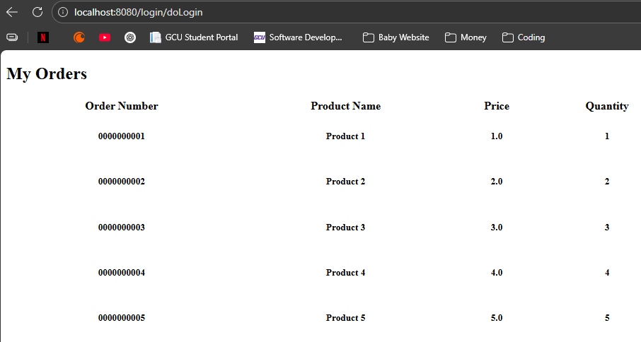

- Screenshot of the data validation errors

    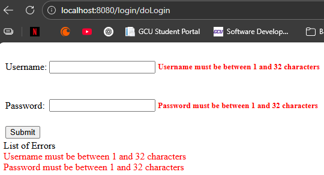

## Part 3: Creating Layouts Using Thymeleaf

### Screenshots

- Screenshot of the new Login page

    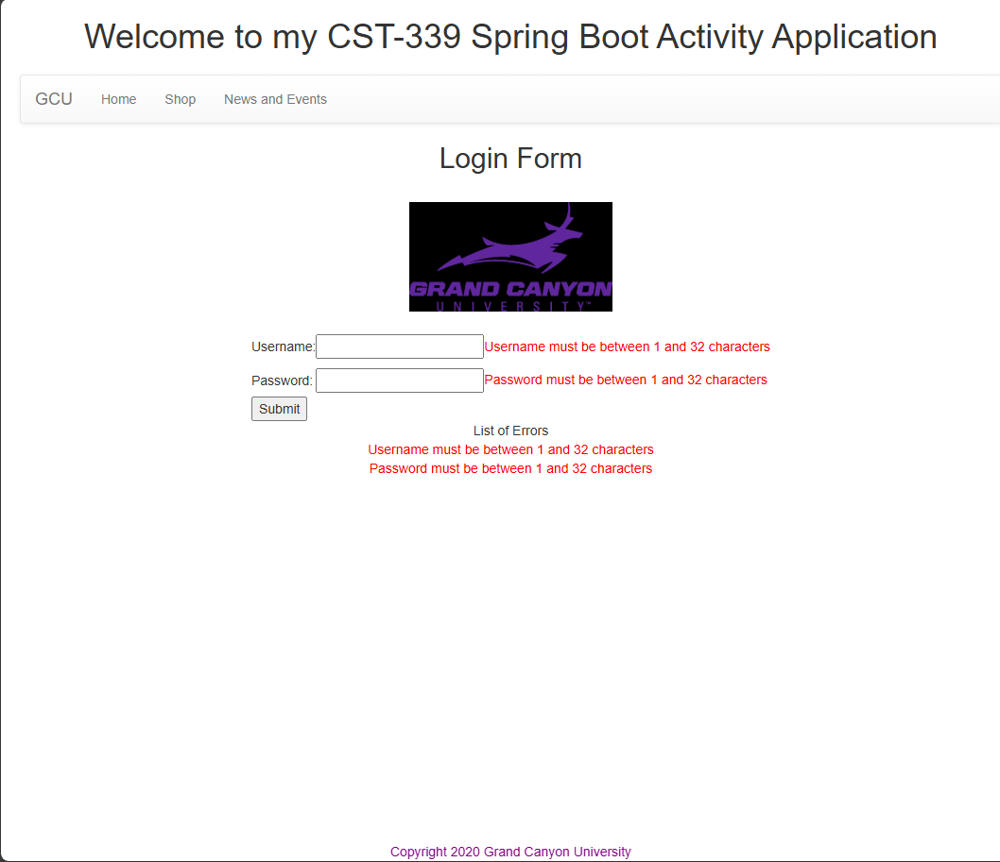

- Screenshot of the new Orders page

    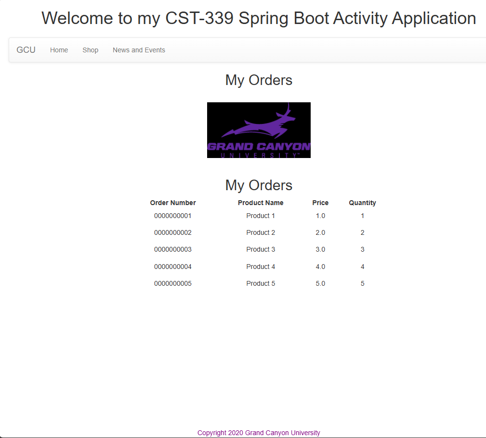

