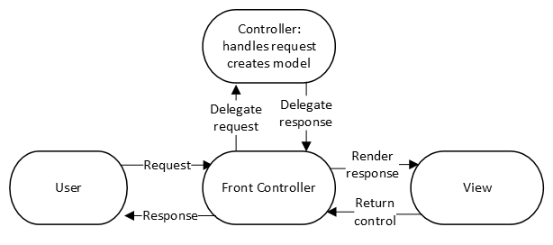

# Activity 2 - Spring Model View Controller (MVC)
CST-339: Java III  
Justin Albecker  
1/25/2026

## Part 1: Creating Models, Views, and Controllers Using Spring MVC

### Screenshots
- Screenshot of the first MVC test screen

    

- Screenshot of the second MVC test screen

    
   
- Screenshot of the third MVC test screen

    

- Screenshot of the fourth MVC test screen

    

- Screenshot of the fifth MVC test screen

    

- Screenshot of the sixth MVC test screen

    

    

- Screenshot of the JAR file test

     

## Part 2: Creating Forms with Data Validation Using Spring MVC

### Screenshots

- Screenshot of the Login Form with no data validation

    

- Screenshot of the table

    

- Screenshot of the data validation errors

    

## Part 3: Creating Layouts Using Thymeleaf

### Screenshots

- Screenshot of the new Login page

    

- Screenshot of the new Orders page

    

## Discussion Posts

1. Spring MVC supports the Model–View–Controller (MVC) design pattern by enforcing a clear separation of responsibilities across application layers (Web MVC framework, 2026). Incoming HTTP requests are handled by the DispatcherServlet, which acts as a front controller and routes requests to the appropriate @Controller methods based on handler mappings (Web MVC framework, 2026). Controllers process user input, interact with the model to prepare application data, and return a logical view name instead of rendering output directly (Web MVC framework, 2026). The model holds the application data, while the view (often implemented with Thymeleaf) uses that data to generate the user interface without containing business logic (Web MVC framework, 2026). This structure improves maintainability, scalability, and testability by isolating concerns.  
References:  
Spring (2026). Web MVC framework. Retrieved on 26 January 2026 from https://docs.spring.io/spring-framework/docs/3.2.x/spring-framework-reference/html/mvc.html

    

2. 

# Conclusion
This activity strengthened my understanding of the Spring MVC framework by implementing controllers, models, and views to handle multiple request types and dynamic content. It also demonstrated how to build interactive web applications using Thymeleaf forms, model binding, and JSR-303 data validation to ensure proper user input handling. Finally, the use of Thymeleaf layouts reinforced best practices for creating reusable and consistent page designs, preparing me for building more structured and maintainable Spring Boot applications.