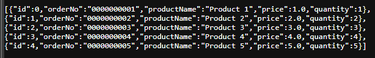
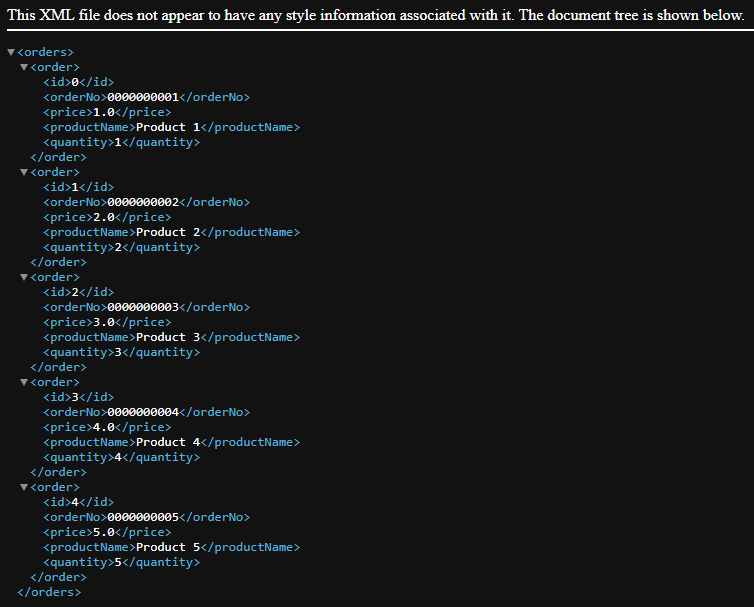
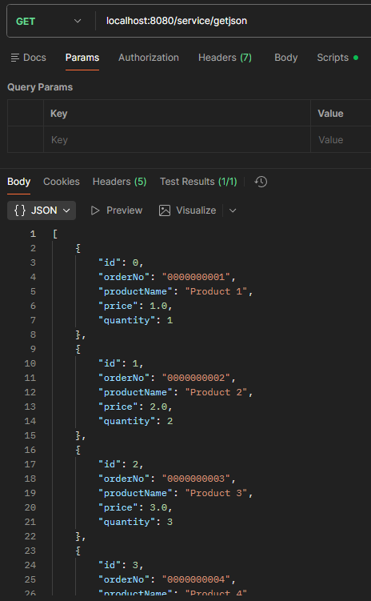
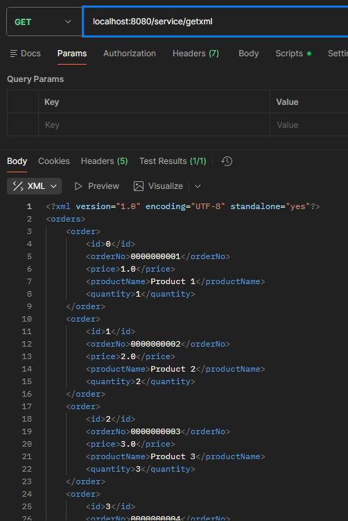

# Activity 3 - Spring Core
CST-339: Programming in Java III  
Justin Albecker  
2/8/2026

## Part 1 - Creating Spring Bean Services Using Spring Core
### Screenshots

- Screenshot of the Interface being called


- Screenshot of the AnotherOrdersBusinessService() being called


- Screenshot of the SecurityBusinessService class being called


- Screenshots of the getOrders() method functioning properly


## Part 2 - Spring Bean Life Cycle and Scopes
### Screenshots

- Screenshot of the init and destroy test messages being displayed
  
#### Theory of Operation:
After placing the @Bean annotation and adding the initMethod attribute with the value of init, the program will run the init method upon initializing the program. Similarly, the destroyMethod with the attribute of destroy works the same way, but when the program stops. The methods will only run upon starting the program and stopping the program, no other times in this current configuration.

- Screenshot of the init message being shown after @Scope is implemented  

  
#### Theory of Operation:
When adding the @Scope("prototype"), it will display the init() test message twice upon each entry of doLogin() in the LoginController. Not only does it print for each entry, it now duplicates the init method, resulting in two test messages being displayed. Additionally, with the inclusion of the @Scope("prototype"), the destroy method will not run automatically anymore, it must be called manually in order to run.

- Screenshot of the @RequestScope addition being run


#### Theory of Operation:
After replacing @Scope("prototype") with @RequestScope, the init method will be accessed each time the login page is requested. Upon leaving the login page (to enter the doLogin page), the destroy method is accessed.

- Screenshot of the @SessionScope addition being run


#### Theory of Operation:
Replacing @RequestScope with @SessionScope allows for a new instance of the OrdersBusinessService to be accessed for each unique browser session, rather than each individual access attempt. As can be seen in the screenshot above, the init test message displays upon the initial login attempt, when the user attempted to login a second time in the same browser, the init message did not appear. The third login attempt was made from a different browser, this time the init test message was displayed. It should also be noted that the destroy message does not appear automatically when the page is stopped.

- Screenshot of the Singleton Scope being run


#### Theory of Operation
After the removing the @RequestScope, the Spring default Singleton Scope will be used. The init method was accessed upon page initialization, and does not get used again until the page is stopped and run again. The destroy method does appear upon stopping the page.

## Part 3 - Creating REST Services Using Spring REST Controllers

### Screenshots

- Screenshot of the JSON response



- Screenshot of the JSON response



- Screenshot of Postman JSON response



- Screenshot of Postman XML response




### Orders REST API Design
#### Base URL:  localhost:8080/service
|End Point|URL|HTTP Method|Description|Success Response|
|--|--|--|--|--|
|Get Orders (JSON)|/getjson|GET|Returns a list of orders in JSON format|List of OrderModel objects|
|Get Orders (XML)|/getxml|GET|Returns a list of orders in XML format|List containing OrderModel objects|

### Example Outputs:

#### localhost:8080/service/getjson
```json
[{"id":0,"orderNo":"0000000001","productName":"Product 1","price":1.0,"quantity":1},  
{"id":1,"orderNo":"0000000002","productName":"Product 2","price":2.0,"quantity":2},]
```

#### localhost:8080/service/getxml
```xml
<orders>    
    <order>
        <id>0</id>
        <orderNo>0000000001</orderNo>
        <price>1.0</price>
        <productName>Product 1</productName>
        <quantity>1</quantity>
    </order>
    <order>
        <id>1</id>
        <orderNo>0000000002</orderNo>
        <price>2.0</price>
        <productName>Product 2</productName>
        <quantity>2</quantity>
    </order>
</orders>
```
## Research Questions
1)  
In Spring, @Component, @Service, and @Bean are all used to define beans, but they differ in purpose and usage. @Component is a generic stereotype annotation that marks a class for component scanning so Spring can automatically detect and register it as a bean (@Component vs @Repository and @Service in Spring, 2024). @Service is a specialized form of @Component intended for the service or business layer, helping clearly indicate that a class contains business logic and improving architectural readability, even though it behaves the same as @Component at runtime (@Component vs @Repository and @Service in Spring, 2024). In comparison, @Bean is used at the method level inside a configuration class to explicitly create and register a bean, giving developers more control over instantiation and configuration (Shriv, 2020). @Component or @Service should be used for auto-detected classes, while @Bean should be used for manual configuration is required.

References:  
@Component vs @Repository and @Service in Spring (2024). Baeldung. Retrieved on 2/4/2026 from https://www.baeldung.com/spring-component-repository-service  
Shriv H. (2020). Tutorialspoint. Difference between @Bean and @Component annotation in Spring. https://www.tutorialspoint.com/difference-between-bean-and-component-annotation-in-spring

2) 

## Conclusion
This assignment strengthened my understanding of Spring's Inversion of Control (IoC) and Dependency Injection (DI) by implementing and swapping Spring Beans through interfaces and configuration, reinforcing the importance of loosely coupled design. I also learned how bean lifecycle methods and scopes (singleton, prototype, request, and session) affect object creation and management within a Spring application. The final part of this activity introduced REST service development, where I built and tested JSON and XML endpoints using Spring Rest controllers, Swagger-style documentation, and Postman, reinforcing best practices for API design and testing.