# Activity 3 - Spring Core
CST-339: Programming in Java III  
Justin Albecker  
2/8/2026

## Part 1 - Creating Spring Bean Services Using Spring Core
### Screenshots

- Screenshot of the Interface being called

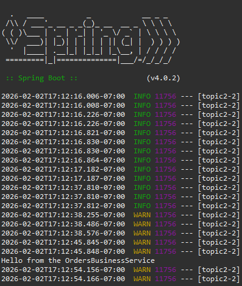

- Screenshot of the AnotherOrdersBusinessService() being called

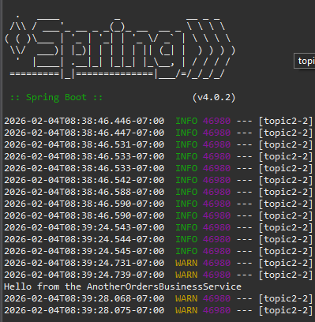

- Screenshot of the SecurityBusinessService class being called

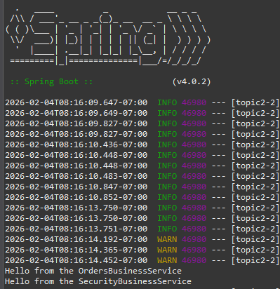

- Screenshots of the getOrders() method functioning properly

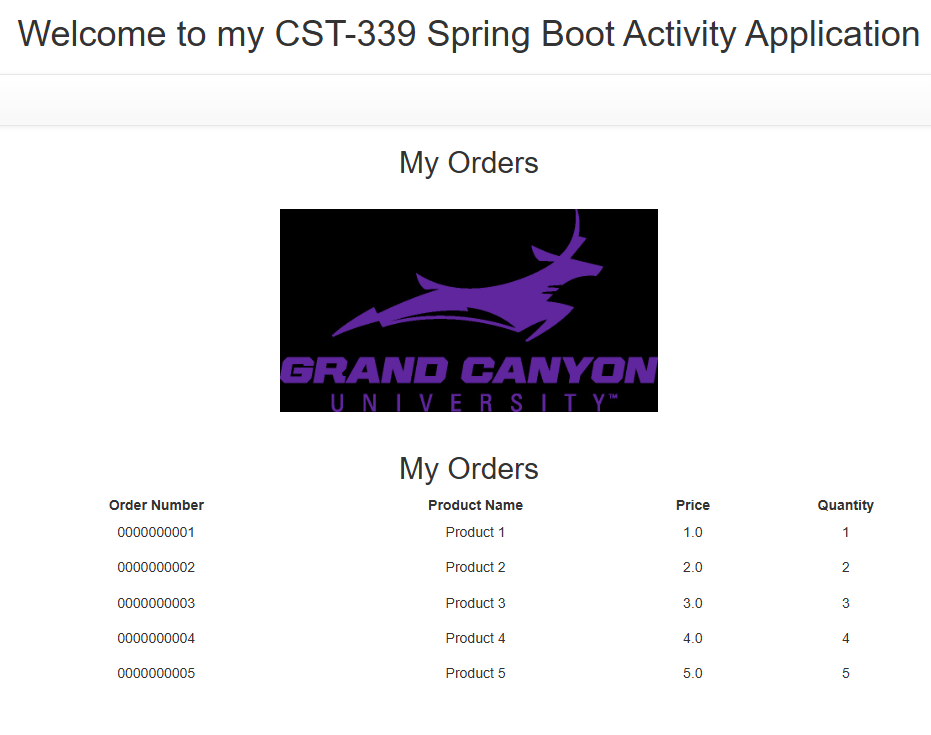

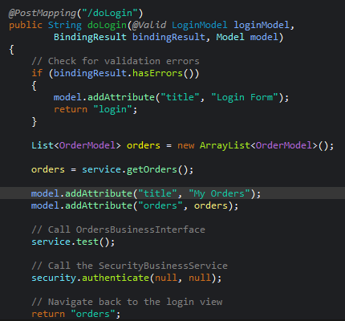

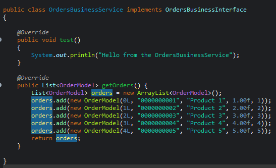

## Part 2 - Spring Bean Life Cycle and Scopes
### Screenshots

- Screenshot of the init and destroy test messages being displayed
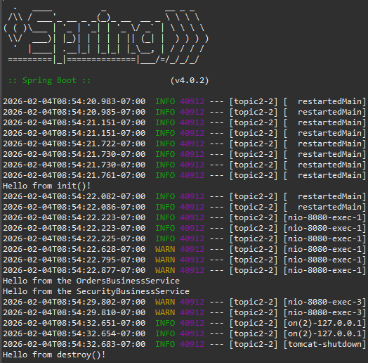  
#### Theory of Operation:
After placing the @Bean annotation and adding the initMethod attribute with the value of init, the program will run the init method upon initializing the program. Similarly, the destroyMethod with the attribute of destroy works the same way, but when the program stops. The methods will only run upon starting the program and stopping the program, no other times in this current configuration.

- Screenshot of the init message being shown after @Scope is implemented  

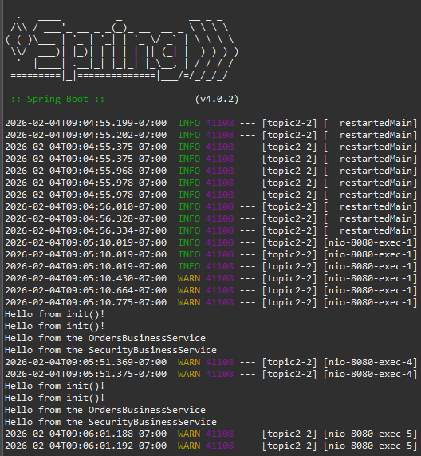  
#### Theory of Operation:
When adding the @Scope("prototype"), it will display the init() test message twice upon each entry of doLogin() in the LoginController. Not only does it print for each entry, it now duplicates the init method, resulting in two test messages being displayed. Additionally, with the inclusion of the @Scope("prototype"), the destroy method will not run automatically anymore, it must be called manually in order to run.

- Screenshot of the @RequestScope addition being run

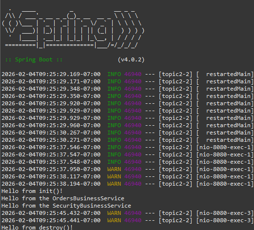
#### Theory of Operation:
After replacing @Scope("prototype") with @RequestScope, the init method will be accessed each time the login page is requested. Upon leaving the login page (to enter the doLogin page), the destroy method is accessed.

- Screenshot of the @SessionScope addition being run

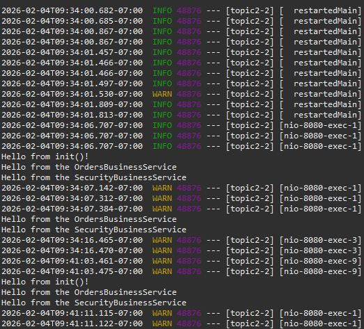
#### Theory of Operation:
Replacing @RequestScope with @SessionScope allows for a new instance of the OrdersBusinessService to be accessed for each unique browser session, rather than each individual access attempt. As can be seen in the screenshot above, the init test message displays upon the initial login attempt, when the user attempted to login a second time in the same browser, the init message did not appear. The third login attempt was made from a different browser, this time the init test message was displayed. It should also be noted that the destroy message does not appear automatically when the page is stopped.

- Screenshot of the Singleton Scope being run

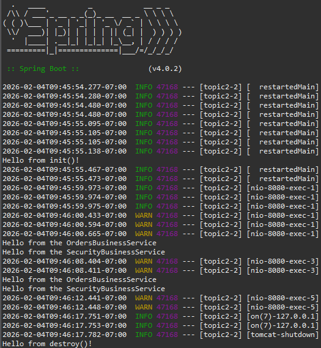
#### Theory of Operation
After the removing the @RequestScope, the Spring default Singleton Scope will be used. The init method was accessed upon page initialization, and does not get used again until the page is stopped and run again. The destroy method does appear upon stopping the page.

## Part 3 - Creating REST Services Using Spring REST Controllers

### Screenshots
