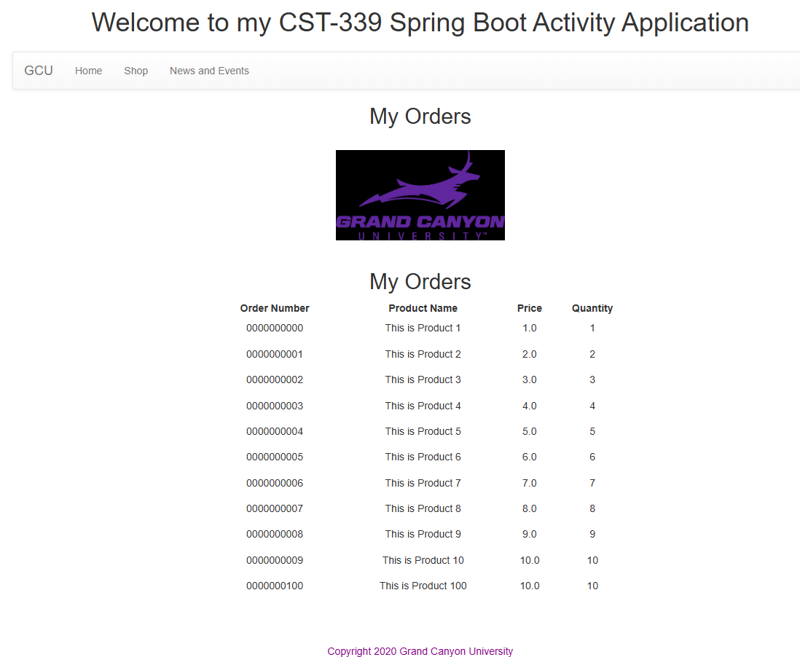
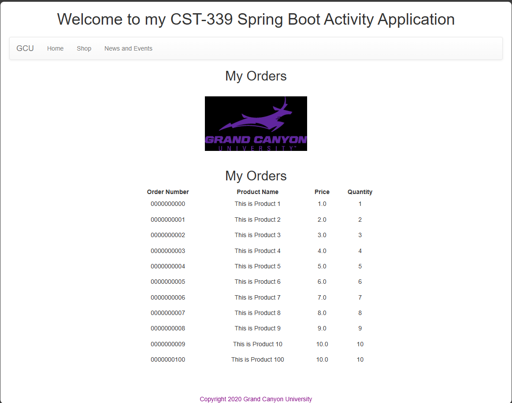
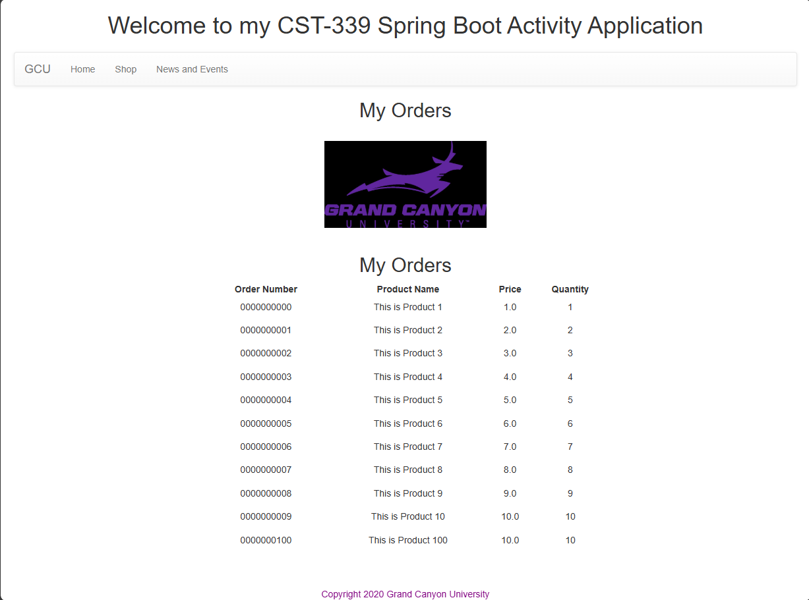

# Activity 4 - Spring Data Java Database Connectivity (JDBC)
CST-339: Programming in Java III  
Justin Albecker  
2/15/2026

---
## Part 1: Creating Data Services Using Spring JDBC
- Screenshot of the Orders page

## Part 2: Creating Data Services Using Spring Data JDBC
- Screenshot of the Orders page

## Part 3: Creating Data Services Using Spring Data JDBC Native Queries
- Screenshot of the Orders page

## Research Questions
1. 

2. 

## Conclusion
