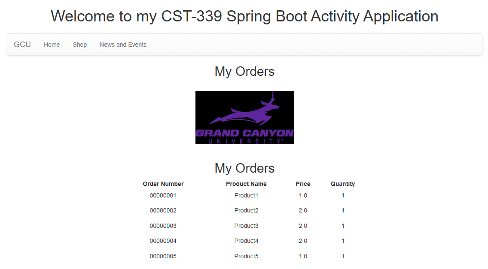
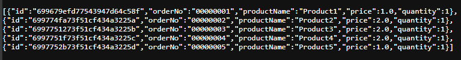
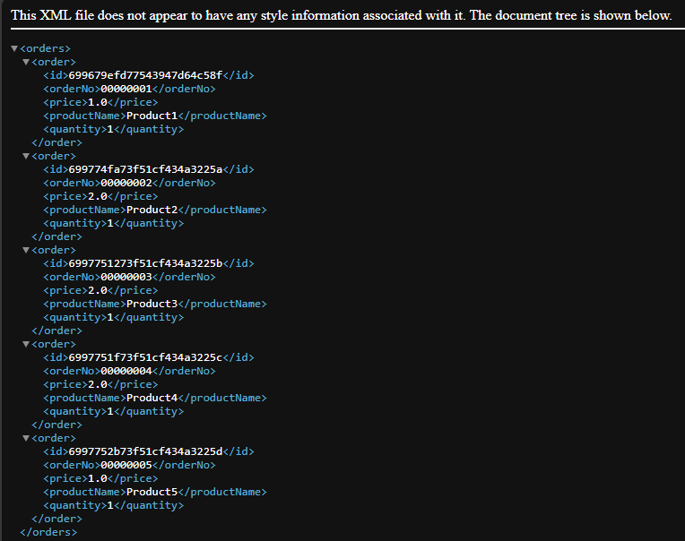
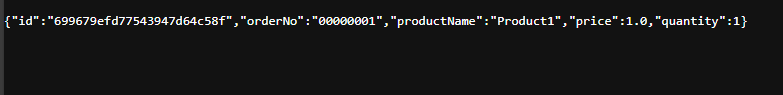

# Activity 5 - Spring Data MongoDB
CST-339: Programming in Java III  
Justin Albecker  
2/22/2026

---
## Introduction
In this assignment, I am going to transition an existing Spring application from a relational MySQL setup to a nonrelational MongoDB database using Spring Data MongoDB. You’ll also extend the application by adding new repository queries and REST endpoints to retrieve data using MongoDB’s document-based model.

## Part 1: Creating data Services Data MongoDB
### Screenshots
- Screenshot of the orders page implementing MongoDB

- Screenshot of the /service/getjson

- Screenshot of the /service/getxml

## Part 2: Adding New Queries in the MongoDB Repository
## Screenshots
- Screenshot of the /service/getorder with a valid input

- Screenshot of the /service/getorder with an invalid input

## Research Questions
1. Relational databases use structured, predefined schemas with tables, rows, and columns, enforcing strict relationships through primary and foreign keys (What’s the Difference Between Relational and Non-relational Databases?, 2026). Non-relational databases, by contrast, store schema-less or flexible data in formats like key-value pairs, documents, or graphs, allowing more adaptability (What’s the Difference Between Relational and Non-relational Databases?, 2026). Migrating from a relational to a non-relational database impacts application design by shifting from rigid schema-based modeling to more flexible data structures (What’s the Difference Between Relational and Non-relational Databases?, 2026). Applications may need to denormalize data, change how relationships are represented, and adapt to different query patterns, since non-relational systems trade strict consistency for scalability and performance flexibility.
Reference:
What’s the Difference Between Relational and Non-relational Databases? (2026) Retrieved on 18 February, 2026 from https://aws.amazon.com/compare/the-difference-between-relational-and-non-relational-databases/

2. Spring Data supports transaction management by using Spring’s @Transactional annotation, which maintains a single persistence context across multiple repository calls (Desmond & Larsen, 2026). This annotation enforces ACID principles: atomicity ensures grouped operations succeed or fail together; consistency guarantees that only valid, constraint-adhering data is committed; isolation manages concurrent transactions, so results match sequential execution; and durability ensures committed data is permanently written (Desmond & Larsen, 2026). Together, these features prevent partial updates, maintain valid application state, and ensure reliable data handling within Spring Data JPA applications.

Reference:
Desmond, R., Larsen J. (2026). Coding Nomads. @Transactional and ACID in Spring Data JPA. https://codingnomads.com/spring-data-jpa-transactional-acid-transactions

## Conclusion
This activity emphasized how to migrate an application from a relational MySQL database to a nonrelational MongoDB database using Spring Data MongoDB, highlighting required changes in configuration, entities, repositories, and service layers. It also introduced creating custom MongoDB queries and implementing REST endpoints with proper response handling. Overall, the exercise reinforced understanding of NoSQL design differences and how they impact application structure, data modeling, and service logic.