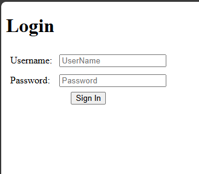
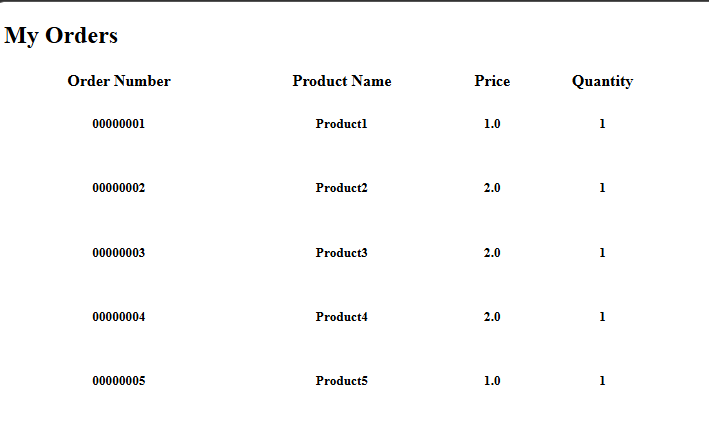
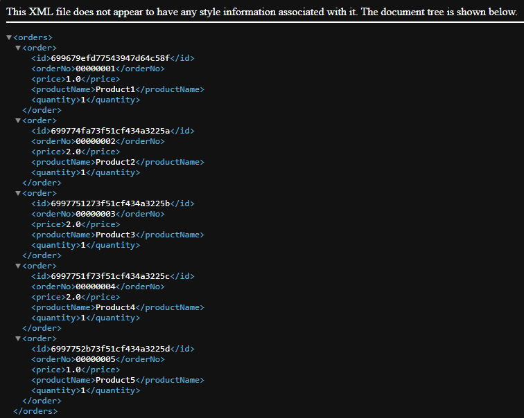
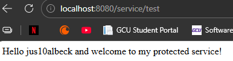

# Activity 6 - Spring Security
CST-339: Programming in Java III  
Justin Albecker  
3/1/2026

---
## Introduction:

In this activity, I will explore how to secure a Spring Boot application using two different approaches: traditional in‑memory authentication and modern OAuth2 authentication with GitHub. Through these steps, I will learn how Spring Security protects both web pages and REST API endpoints. By completing these tasks, I will better understand how authentication flows differ and how they are applied in real applications.

## Part 1: Securing a Web Application Using an In-Memory Datastore
### Screenshots
- Screenshot of the login screen to the application

- Screenshot of the Orders page

- Screenshot of the getxml page

- Screenshot of the getjson page

## Part 2: Securing a Web Application Using a Database

Part 2 was not achievable with the materials provided by the University

## Part 3: Securing REST APIs Using Basic HTTP Authentication

Part 3 was not achievable with the materials provided by the University

## Part 4: Securing REST APIs Using OAuth2 Authentication

### Screenshots

- Screenshot of the GitHub login page

- Screenshot of the API response after Github authentication

## Research Questions

1. Forms-based authentication is a method where users submit their credentials through an HTML login form, allowing the server to verify their identity before granting access to protected resources (What is Form-Based Authentication? 2024). This makes it familiar and user-friendly process for most users, as it typically involves entering a username and password on a webpage. However, because it can be vulnerable to attacks like phishing, brute force, and injection, secure implementation (such as HTTPS, strong password policies, and proper session management) is essential (What is Form-Based Authentication? 2024). Using Spring Security is important because it offers built-in, well-tested mechanisms for handling these security concerns reliably (What is Form-Based Authentication? 2024). Creating a custom security framework introduces unnecessary risk, while Spring Security provides robust, standardized protection with far less development effort.

References:
What is Form-Based Authentication? (2024). Twingate. Retrieved on 25 February, 2026 from https://www.twingate.com/blog/glossary/form-based-authentication

2. Basic HTTP Authentication works by having the server issue a 401 Unauthorized response with a WWW-Authenticate header when a request lacks valid credentials (HTTP authentication, 2026). The client then resends the request with an Authorization header containing a Base64-encoded username and password (HTTP authentication, 2026). The server validates these credentials and grants or denies access accordingly. This challenge-response flow restricts access to protected resources and helps secure REST API endpoints by ensuring only authenticated clients can interact with them (HTTP authentication, 2026). However, because Basic Auth sends credentials encoded but not encrypted, it must be used over HTTPS to remain secure.

Reference:

HTTP authentication (2026) MDN. Retrieved on 2/27/2026 from https://developer.mozilla.org/en-US/docs/Web/HTTP/Guides/Authentication

## Conclusion

After completing the activity, I gained hands‑on experience securing applications using both in‑memory credentials and OAuth2 authentication. I learned how Spring Security manages login flows, protects routes, and integrates with external identity providers like GitHub. Overall, this activity strengthened my understanding of modern authentication practices and how to apply them effectively in Spring Boot.