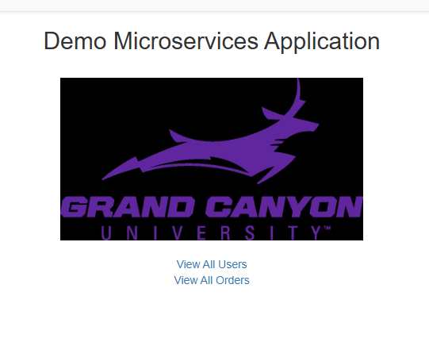
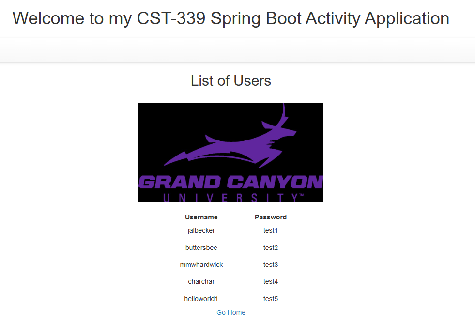
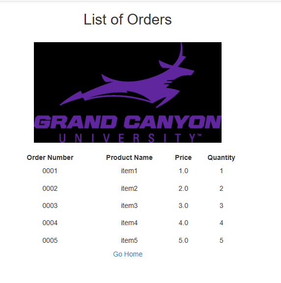
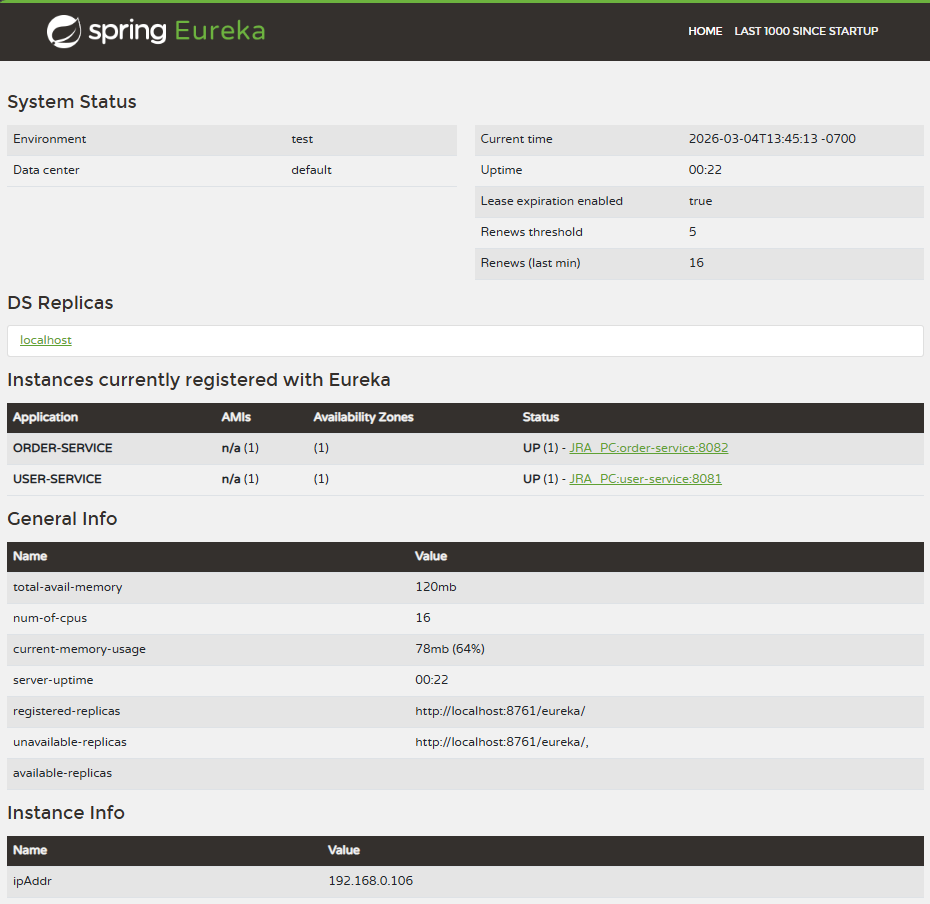
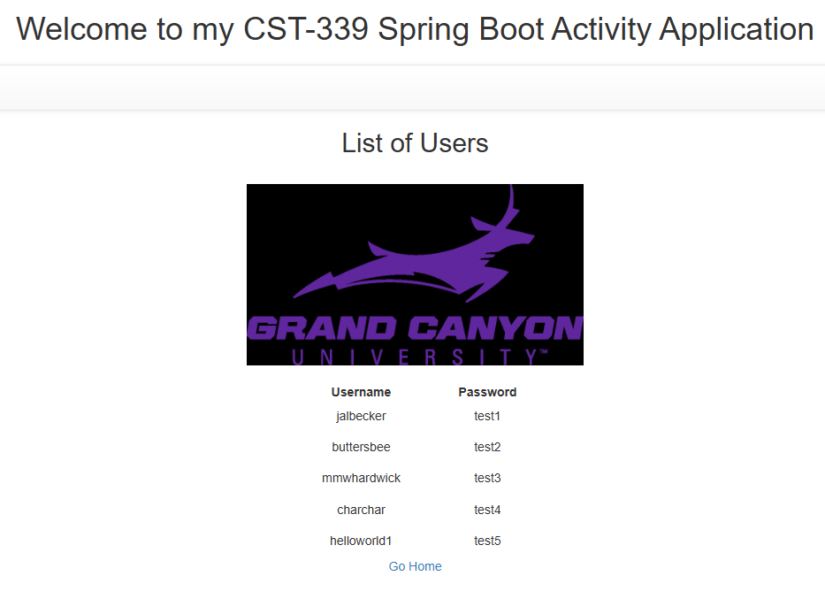
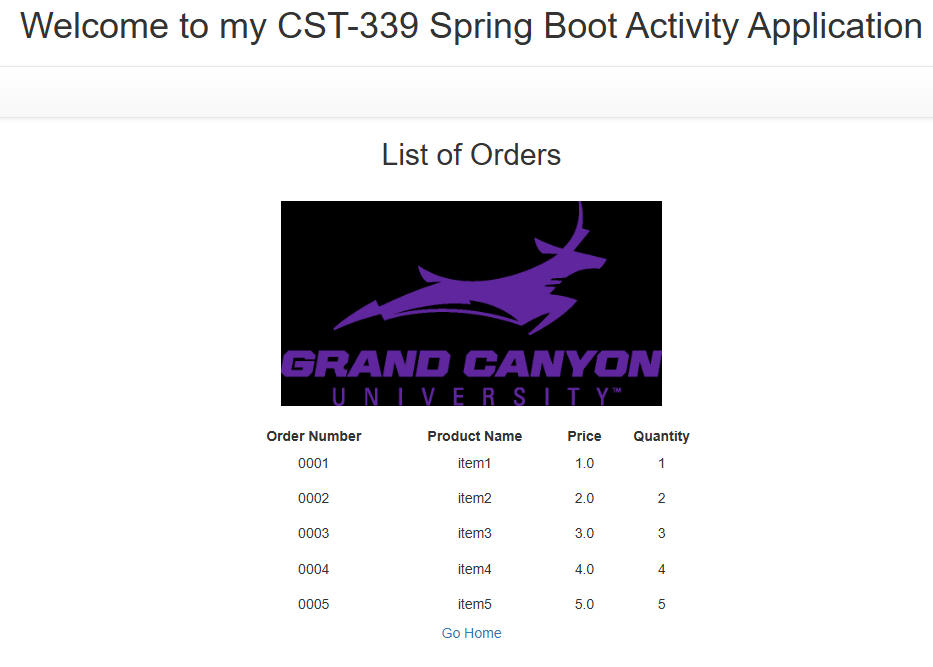

# Activity 7 - Microservices
CST-339: Programming in Java III  
Justin Albecker  
3/8/2026

---
## Introduction:
This assignment guides me through building and enhancing a microservices-based web application using Spring Boot, REST APIs, MongoDB Atlas, and a Service Discovery mechanism. Throughout the activity, I will learn how independent services communicate, how to consume them from a web application, and how to integrate a Eureka Server to support scalable and flexible architecture.

## Part 1: 
### Screenshots

- Screenshot of the home page

- Screenshot of a list of users

- Screenshot of a list of products

## Part 2: 
- Screenshot of the Eureka Server dashboard with both REST APIs registered

- Screenshot of a list of users

- Screenshot of a list of products

## Research Questions

1. Microservices are an architectural style in which an application is built as a collection of small, independent services that each handle a specific business function (Harris, 2025). These services communicate through lightweight APIs and can be developed, deployed, and scaled separately. This design promotes flexibility because teams can update or replace individual components without affecting the entire system (Harris, 2025). In contrast, traditional monolithic architectures package all functionality into one large, interconnected application. While monoliths can be simpler to develop initially, they become harder to scale and maintain as they grow, since even small changes may require redeploying the whole system (Harris, 2025). Microservices avoid this rigidity by allowing services to evolve independently, supporting greating agility, resilience, and scalability across complex applications.

References:

Harris, C. (2025). Atlassian. Microservices vs. monolithic architecture. https://www.atlassian.com/microservices/microservices-architecture/microservices-vs-monolith

2. Migrating from a monolithic architecture to microservices introduces several significant challenges. First, decomposing a tightly coupled monolith into independent services is difficult because identifying clear service boundaries requires deep system understanding (Menachem, 2023). Second, managing data becomes more complex, as each microservice may need its own data store, increasing the difficulty of maintaining consistency across services (Menachem, 2023). Third, microservices introduce operational overhead, requiring robust orchestration, monitoring, and deployment pipelines that monoliths do not demand (Menachem, 2023). Fourth, inter-service communication can cause reliability issues, and the need for resilient API design (Menachem, 2023). Finally, debugging becomes more challenging in a distributed environment because failures may span multiple service, making root-cause analysis more complex (Menachem, 2023).

References:

Menachem, G (2023). Monolith to Microservices: 5 Strategies, Challenges, and Solutions. https://komodor.com/learn/monolith-to-microservices-5-strategies-challenges-and-solutions/

## Christian Worldview Component
A programmer can unintentionally compromise user privacy or consumer security when developing high‑performance, database‑driven applications, especially if data is collected without clear user consent, stored inadequately, or shared without proper authorization. One common situation involves failing to encrypt sensitive user data in transit or at rest, leaving personal information vulnerable to breaches (Lack of encryption for data at rest and in transit, 2025). From a Christian worldview, which emphasizes integrity, stewardship, and love for others, developers and leaders are called to prioritize user well‑being above convenience or speed. Communicating this tactfully to management involves explaining that secure and ethical handling of user data not only protects the organization legally but also aligns with moral responsibility and long‑term trustworthiness, supported by research showing that data breaches cause significant financial and reputational harm.

References:

Lack of encryption for data at rest and in transit (2025). Promon. Retrieved on 3/3/2026 from https://promon.io/mobile-attack-vector-library/lack-of-encryption-for-data-at-rest-and-transit

## Conclusion
This assignment reinforced key concepts such as microservice design, RESTful API consumption, service decoupling, and the use of a Eureka Server for service discovery. By implementing these components, I gained hands‑on experience in creating scalable, maintainable applications that operate independently yet integrate seamlessly. Together, these elements highlight the advantages of modern cloud‑ready architectures over traditional monolithic designs.