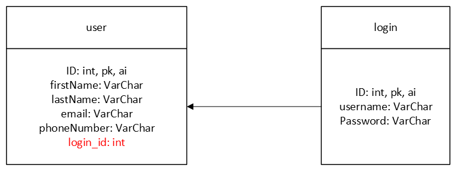
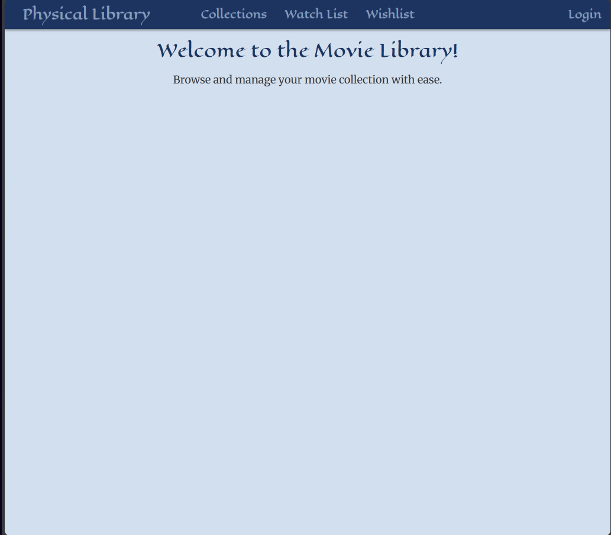
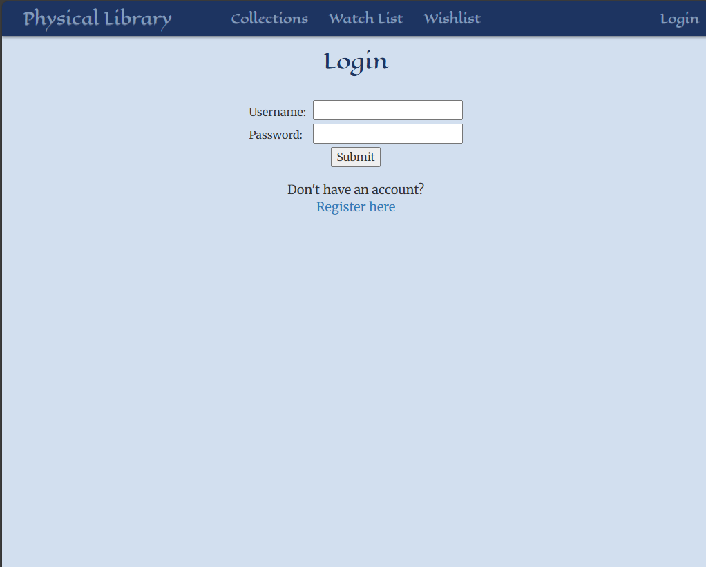
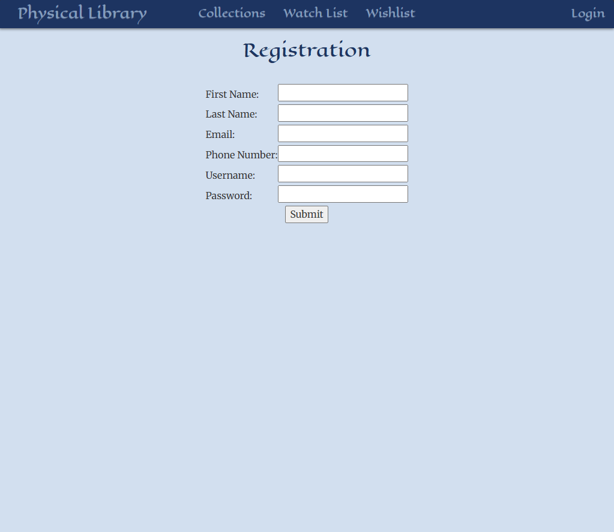
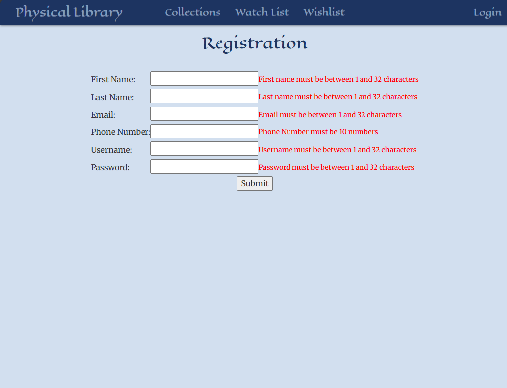

# Milestone 2
CST-339: Programming in Java III  
Justin Albecker  
Prof. Estey  
2/1/2026

---
## Planning Documentation
### Initial Planning
This project will be a library of physical movies owned, a wishlist of what movies need to be acquired, and a list of all movies that the user has watched. At a later date, this website will use a database to hold all user information.
### Retrospective Results
So far, this project has made me realize that I am very rusty with the html coding language. Most of my struggles in this first milestone assignment was trying to get the html and bootstrap to work as intended.
## Design Documentation

### Technical Approach
For this week's project, I relied heavily on the Activity 1 and 2 assignments as guides. While the main code is similar to the activity assignments, I added new pages, focused on new fonts and color schemes, and tried to debug as much as possible for new features in the future.
### Key Technical Design Decisions
For me, this website needs to feel easy to view at anytime. For me, that color scheme is a muted blue palette. I also believe that hover effects and shadows do make a website significantly better. Currently all hover effects are being used in the navigation bar, once there is more content in the body of the website, there will undoubtedly be more interactive elements.
### Risks
The biggest risk I am currently worried about is having time to implement all of the features I desire, while still  implementing assignment requirements. Luckily, if I realize my goals are too lofty for the timeframe of this course, I will be able to work on this project after.
Another risk I am worried about is my organization when implementing new features in the coming weeks. I have a tendency to forget to comment code, leading to my code feel like a rat's nest. If I focus on commenting consistently, I believe I can avoid a messy workspace and implent new features much easier.
## Sitemap Diagram
- Sitemap

- Proposed user and login tables for the database. More tables will be added further into development.

 

## User Interface Diagram
### Homepage
 

The screenshot above depicts the homepage for my website. While still missing key aspects from my proposed sitemap, it is still a strong foundation. All pages features the navigation bar. It should be noted that the Collections, Watch List, and Wishlist tabs are not operational yet (just placeholders for when I implement the new pages). The "Physical Library" text is the home button, and the Login text is to log in.

### Login

The above screenshots depicts the login page and error handling. In future builds this page will allow the user to log in for the personal data. When the user submits the correct information, the user returns to the homepage. The "Register here" text brings the user to the Registration page.

### Register

The above screenshots depicts the Registration page and error handling. In future builds this page will allow the user to register for an account to hold data. When the user properly submits their information, the user gets brought to the login page, allowing the user to then login with their new account information.

## Links
- [Screencast URL](https://youtu.be/OyuTDbnffFE)

- [Milestone Code](https://github.com/jus10albeck/cst339/tree/main/milestones/milestone2/cst339milestone)
