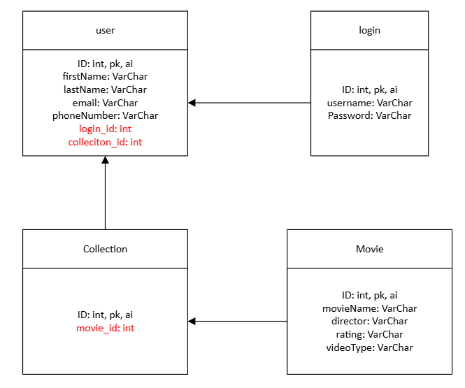
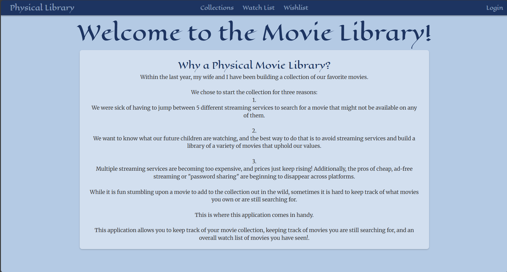
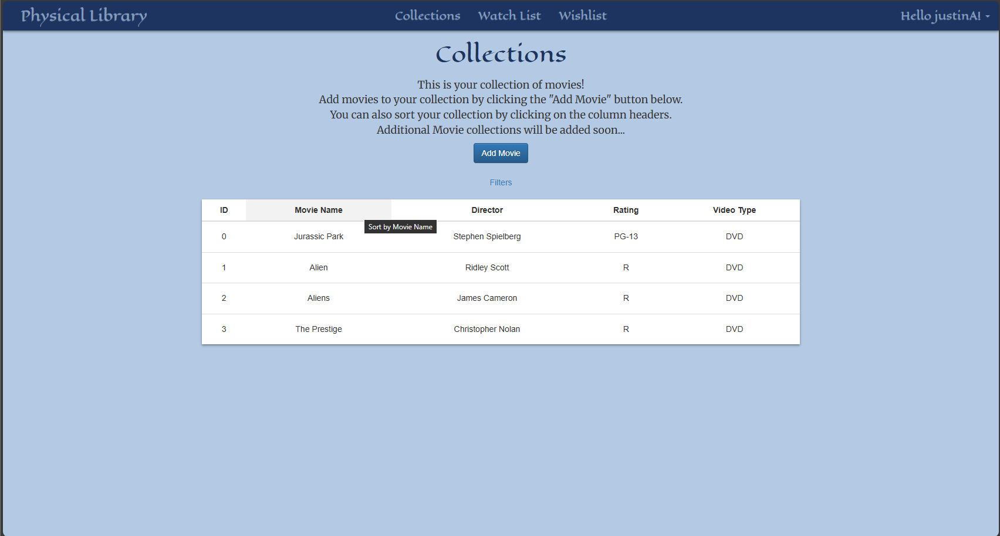
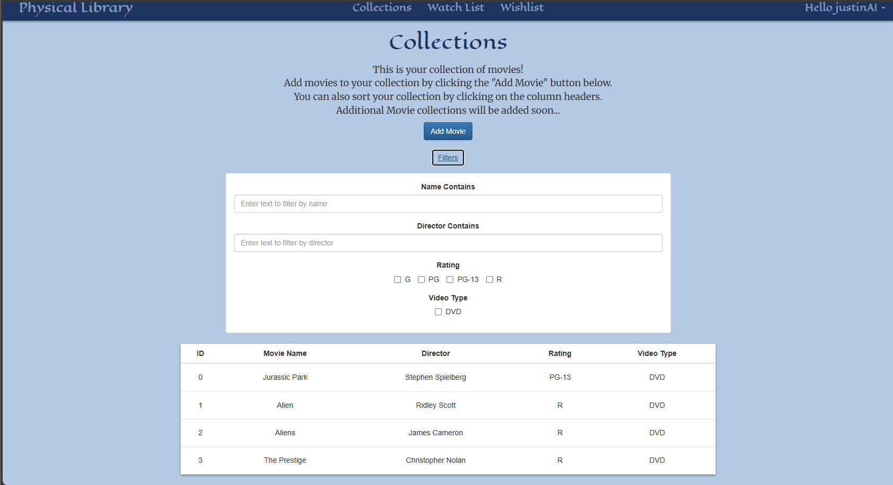
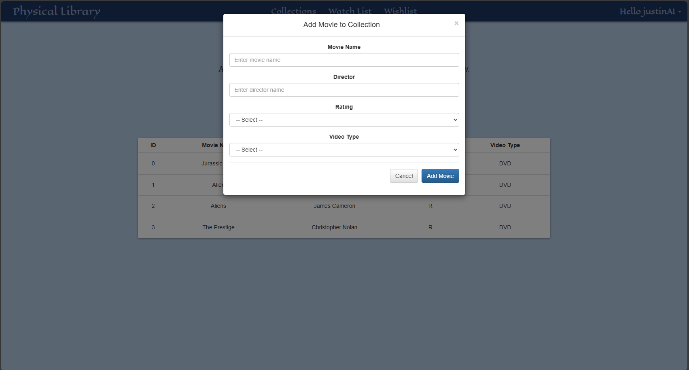
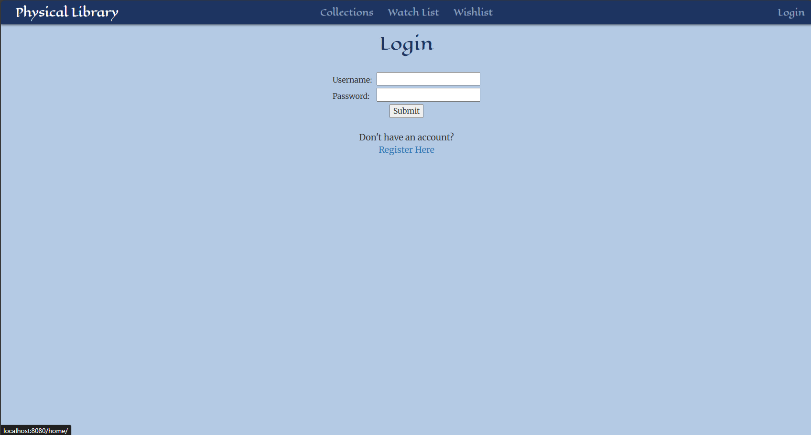
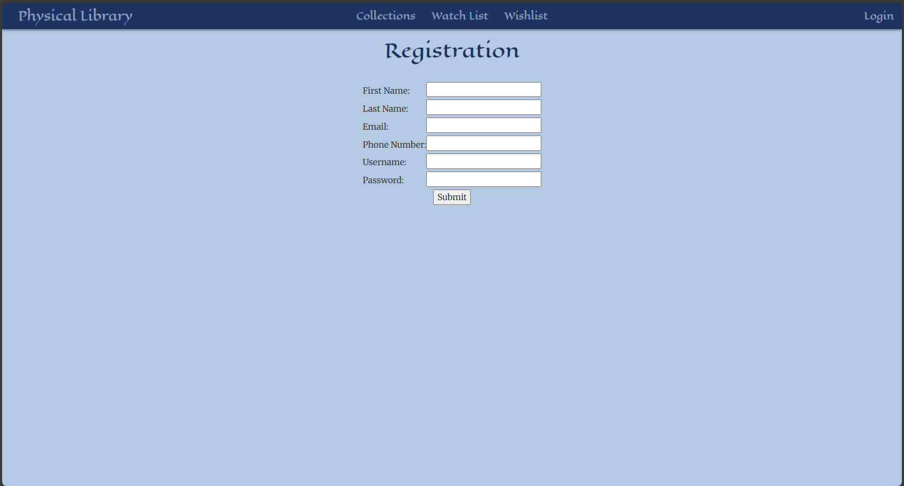

# Milestone 3
CST-339: Programming in Java III  
Justin Albecker  
Prof. Estey  
2/8/2026

---
## Planning Documentation
### Topic 3 Planning
The plan for this week was to create the Collections page and implement the ability to add movies to the collection without the database and integration of Spring Beans and IoC in the existing Login and registration modules. 
### Retrospective Results
This week's milestone assignment was relatively straightforward. The biggest issues I faced this week was implementing the "product creation" modal and planning on hooking that up directly to the database without connecting it to Spring Beans. I realized that I would not be following the assignment's requirements, so I had to change course. Luckily I was able to keep the Modal look and still implement the Spring Beans into it. Other time-consuming tasks included adding a filtering system and sorting within the table. I believe if I spent a little more time organizing and planning what I wanted to implement, I would have had an easier time with this week's assignment. Going forward I will do better with making a plan before I start updating the code.
## Design Documentation
### Technical Approach
This week I relied on Activity 2 and 3 to create the new Collection page and integrating Spring Bean. I also knew I was going to be doing extensive html, css, and javascript work this week, so I had rely heavily on old notes website's I have made in the past, and online resources for help.
### Key Technical Design Decisions
I am very proud of my implementation of filters, modal for object creation, and sortable tables for the Collections page. These are important features that I desire in these types of websites, so implementing them into my website felt nice.
### Risks
While I am doing better about commenting code, I can already start to feel a little bit of "rats nest" showing up throughout my code. To avoid confusion in the future, I am going to add more comments and organize my code to keep track of changes that will inevitably happen in the future.
## Sitemap Diagram
- Sitemap 

- Proposed database for user, login, collection, and movies. More will be added in development

## User Interface Diagram
### Homepage

### Collections
- Screenshot of the collections page

- Screenshot of the different filter options

- Screenshot of the add movie modal

### Login

### Register

## Links
- [Screencast URL](https://youtu.be/ZNF7DykRewA)

- [Milestone Code](https://github.com/jus10albeck/cst339/tree/main/milestones/milestone3/cst339milestone)