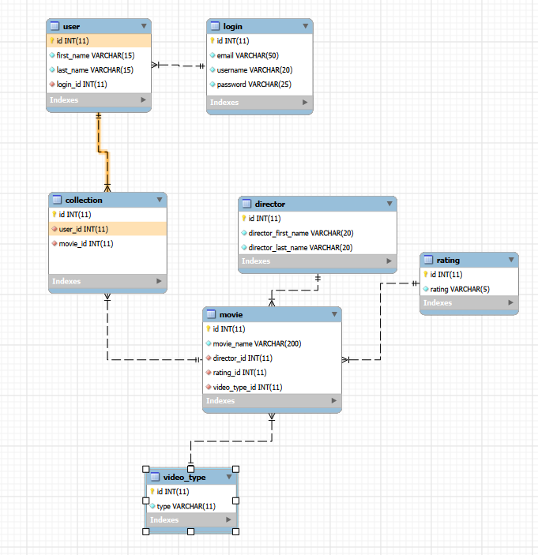
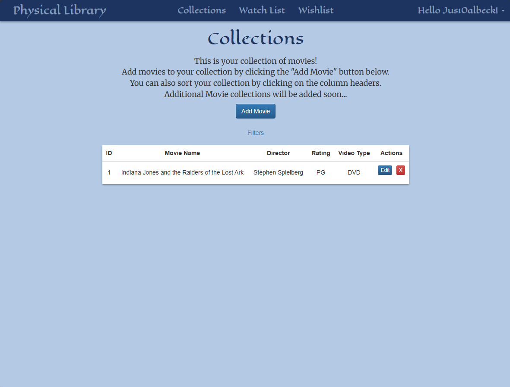
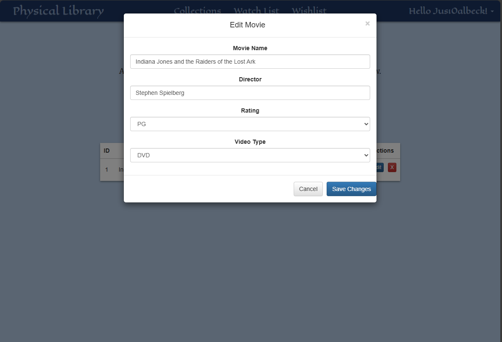
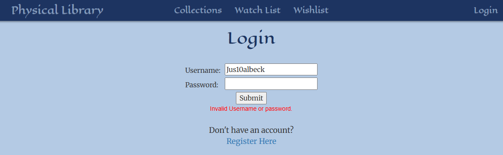
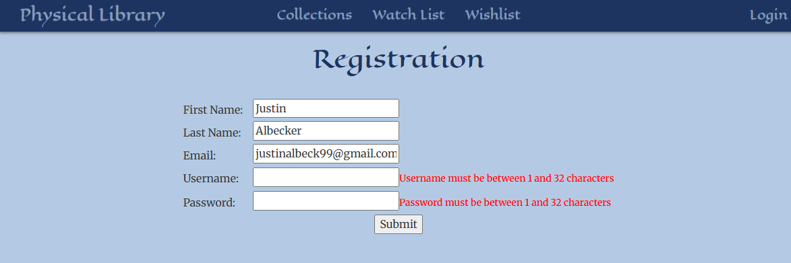

# Milestone 4
CST-339: Programming in Java III  
Justin Albecker  
Prof. Estey  
2/15/2026

---
## Planning Documentation
### Topic 4 Planning
I knew that this week's assignment would include implementing a database into the website, so I spent a lot of time planning for the database's implementation.
### Retrospective Results
In retrospect, I am very happy with how the implementation of the database went. However, I did get a few steps ahead and added an editing function. This definitely caused some stress, but ultimately I am happy with how it turned out.
## Design Documentation
### Technical Approach
My approach was the old fashioned saying, "Slow is smooth, smooth is fast". I knew that if I tried rushing through implementing the database, I would make major errors and get very lost. I chose to work very slowly through the code and test my code very often.
### Key Technical Design Decisions
I tried to follow the database normalization forms as closely as possible for a clean database that can be easily implemented.
### Risks
Risks include adding more features in the future and it causing issues for the current iteration of the database and website.
## Sitemap Diagram
- Sitemap 

- Database

## User Interface Diagram

### Collections
- Screenshot of the collections page

- Screenshot of the Edit Movie modal

### Login
- Proof of login being connected to a database

### Register
- Proof of Registration having error checks

## Links
- [Screencast URL](https://youtu.be/7TMyIMs6p_k)

- [Milestone Code]()