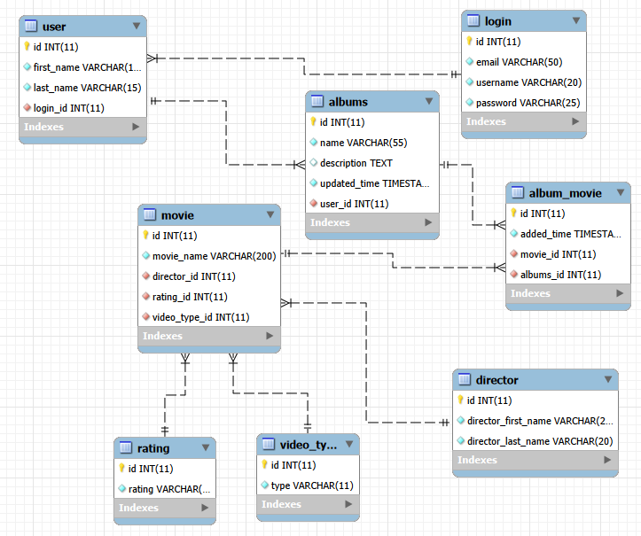
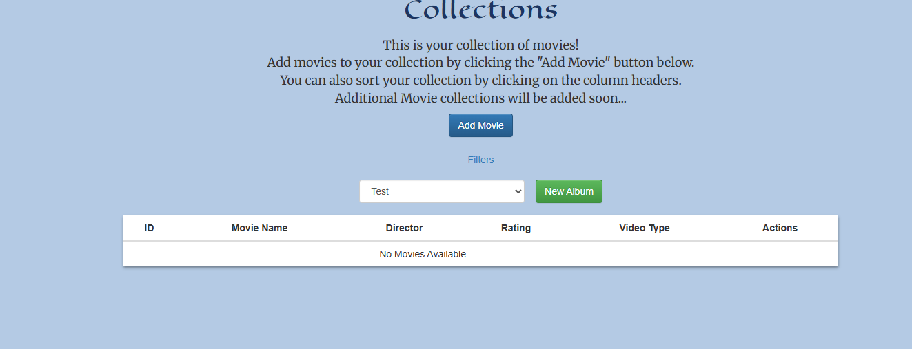
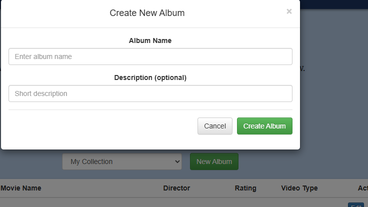
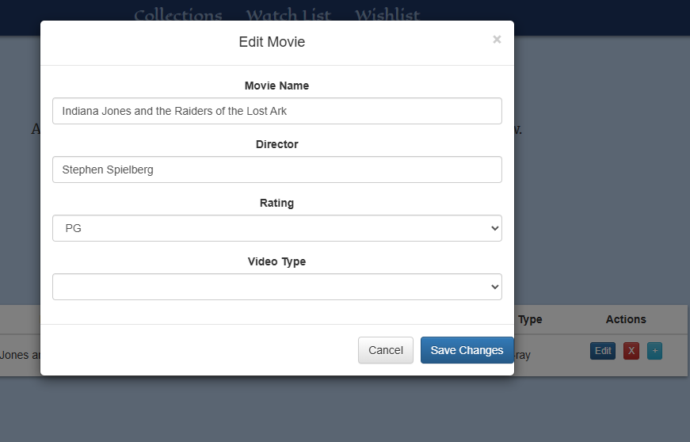
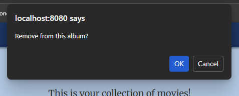
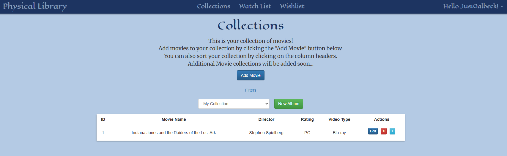

# Milestone 5
CST-339: Programming in Java III  
Justin Albecker  
2/22/2026

---

## Planning Documentation
### Topic 5 Planning
This week, my idea was to add the multiple album function for the collections page. Functions like adding movies to albums, removing movies from albums, and creating new albums was going to implemented.
### Retrospective Results
Creating separate/new albums was trickier than initially imagined. I realized my collections table needed to get updated into a new table called album and album_movie. Luckily, this update didn't cause too much problems, the only issue was trying to update the code to account for the changing of table functionality.
## Design Documentation
### Technical Approach
I continued the "slow is smooth, smooth is correct" mentality for this week's project. So far this approach is working very well for me. I am doing better with comments and clear, concise code.
### Key Technical Design Decisions
The decision to keep things simple with clear labels and consistent layout is making the design of the website very easy on the eyes and easy to use. Sure, there are updates that need to be done, but in the current iteration of the website, I am happy with it's design and functionality.
### Risks / bugs
A bug that I found during my video explanation was that when removing a movie from the main collection, it does not remove the movies from all of the different albums in the database. While not a bug, another "fix" I need to make is adding the option to delete a user's albums.
## Sitemap Diagram
- Sitemap 

- Database

## User Interface Diagram

### Collections
- Screenshot of the collections page

- Screenshot of adding a movie to an album

- Screenshot of creating new albums

- Screenshot of the modal to edit movies

- Screenshot of removing a movie from album

- Screenshot of the collections page

## Links
- [Link to Video Explanation](https://youtu.be/YmPAX7DtK5Q)

- [Link to the Code](https://github.com/jus10albeck/cst339/tree/main/milestones/milestone5/cst339milestone)