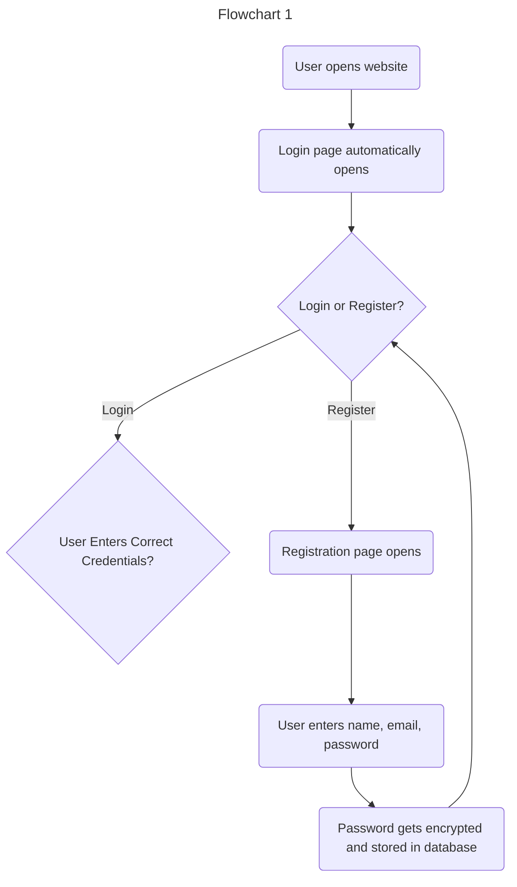
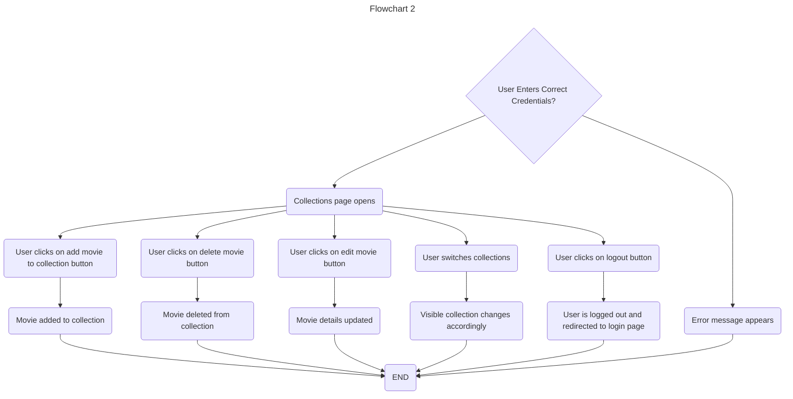
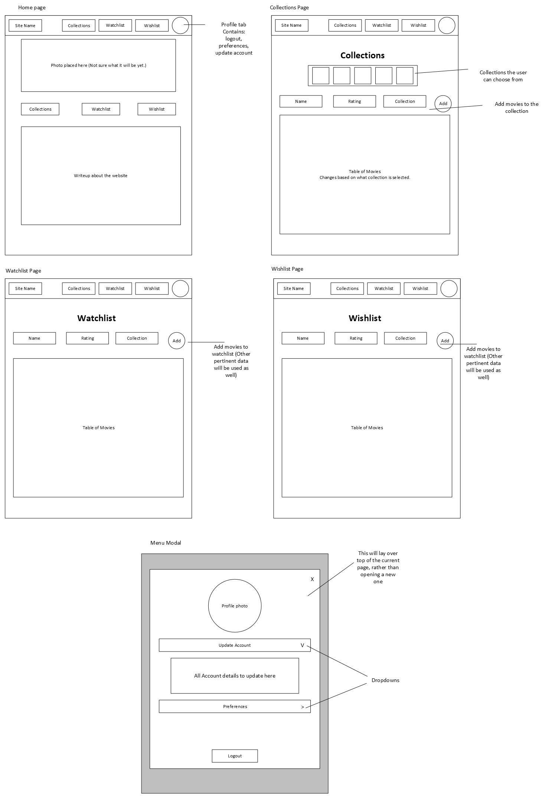
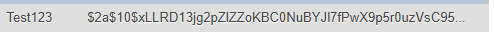

# Milestone 6
CST-339: Programming in Java III  
Justin Albecker  
3/1/2026

---

## Planning Documentation
### Initial Planning
Going into this week, I was ready to implement security into my website. My plan was to make small changes this week to ensure proper password encryption, and other security requirements for this milestone assignment.
### Retrospective Results
This week's milestone update was more difficult to implement than I expected. I felt this week's activity assignment did not prepare me for implementing Spring Security into my project. That being said, I was able to successfully implement what I wish to.
## Design Documentation
### General Technical Approach

### Key Technical Design Decisions

### Risks/Bugs Remaining
A major issue that I realized before submission is that I did not encrypt username's as well. While doing this week's updates, my thought process was that as long as the passwords are encrypted, that should be enough. I now realize that even if passwords are encrypted, any account access information is dangerous for potential hacks/leaks. This will be updated next week.
## Photos
### Website Flowchart

### Sitemap

### Proof of Encryption

## Links

- [Video Explanation Link](https://youtu.be/I_fIKBmmlYI)
