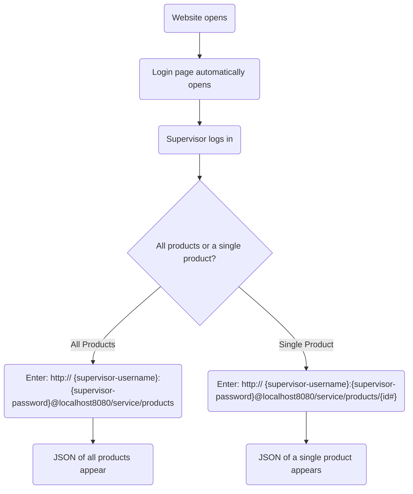

# Milestone 6
CST-339: Programming in Java III  
Justin Albecker  
3/8/2026

---

## Planning Documentation
### Initial Planning
Going into this project, I was very unsure of what this week's milestone project would focus on. I was definitely thrown off by the Activity of this week focusing on microservices. After figuring out what the assignment was actually asking me to do, I planned on implementing the systems, and any additional features I have time to implement.
### Retrospective Results
Implementing the Spring Security protected REST API was relatively difficult to implement. At first I thought I needed to implement microservices, and new html pages. After much trial and error, I realized I was severely over-complicating what the milestone project was asking me to do. After I lowered my scope, the implementations were a breeze. This taught me, yet again, that I need to fully understand the assignment before jumping into the work.
## Design Documentation
### General Technical Approach
This milestone assignment didn't require much design decisions. The main "design" decision was how I wanted to implement the "Delete Album" button. I wanted the button to stand out and make the purpose abundantly clear. I also wanted it to mirror the "Add Album" button on the other side of the album selector.
### Key Technical Design Decisions
The key design I went with was secure, yet simple. The REST API is secured by enforcing Basic HTTP Auth, and restricts access by role.
### Risks/Bugs Remaining
I still need to implement the encryption of the usernames. I attempted implementing it, but ran into some issues that I was unable to crack quite yet. So rather than pushing a not-quite-ready or broken function, I elected to hold off on updating that function. I should have this fixed in the final milestone project.
## Photos
### REST API Flowchart
Flowchart of how to access the REST API data.


### REST API Design
REST API Design created using Swagger

```JSON
{
  "openapi": "3.0.1",
  "info": {
    "title": "Movie Library API",
    "description": "Milestone 7 REST API Documentation",
    "version": "1.0"
  },
  "servers": [
    {
      "url": "http://localhost:8080",
      "description": "Generated server url"
    }
  ],
  "security": [
    {
      "basicAuth": []
    }
  ],
  "paths": {
    "/service/products": {
      "get": {
        "tags": [
          "products-rest-controller"
        ],
        "operationId": "getAll",
        "responses": {
          "200": {
            "description": "OK",
            "content": {
              "*/*": {
                "schema": {
                  "type": "array",
                  "items": {
                    "$ref": "#/components/schemas/ProductDto"
                  }
                }
              }
            }
          }
        }
      }
    },
    "/service/products/{id}": {
      "get": {
        "tags": [
          "products-rest-controller"
        ],
        "operationId": "getOne",
        "parameters": [
          {
            "name": "id",
            "in": "path",
            "required": true,
            "schema": {
              "type": "integer",
              "format": "int64"
            }
          }
        ],
        "responses": {
          "200": {
            "description": "OK",
            "content": {
              "*/*": {
                "schema": {
                  "$ref": "#/components/schemas/ProductDto"
                }
              }
            }
          }
        }
      }
    }
  },
  "components": {
    "schemas": {
      "ProductDto": {
        "type": "object",
        "properties": {
          "id": {
            "type": "integer",
            "format": "int64"
          },
          "movieName": {
            "type": "string"
          },
          "director": {
            "type": "string"
          },
          "rating": {
            "type": "string"
          },
          "videoType": {
            "type": "string"
          }
        }
      }
    },
    "securitySchemes": {
      "basicAuth": {
        "type": "http",
        "scheme": "basic"
      }
    }
  }
}

```

## Links

- [Video Explanation Link](https://youtu.be/vD47bcVEW-E)
- [Link to Code](https://github.com/jus10albeck/cst339/tree/main/milestones/milestone7/cst339milestone)