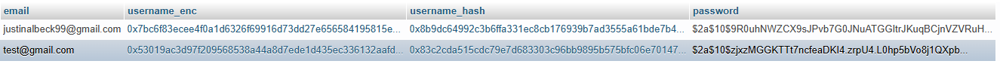
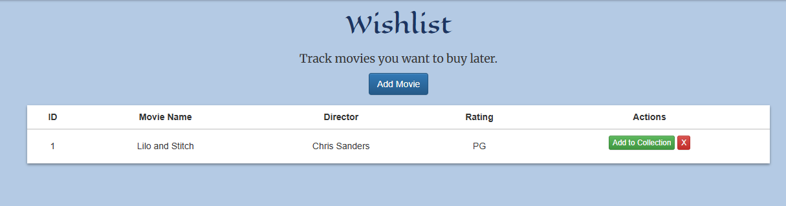
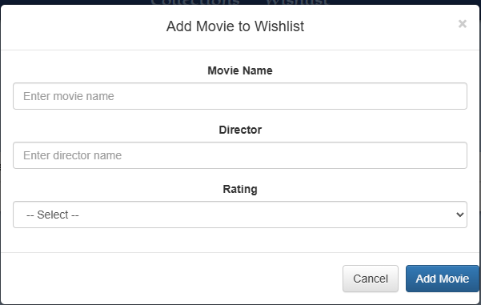
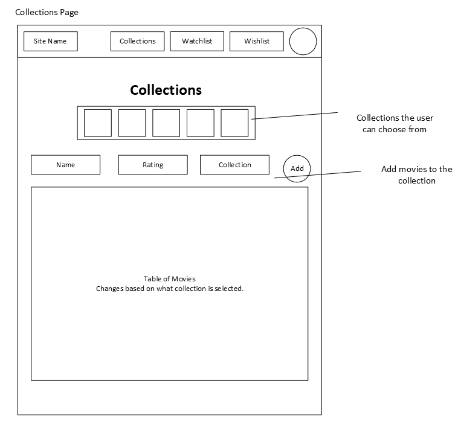
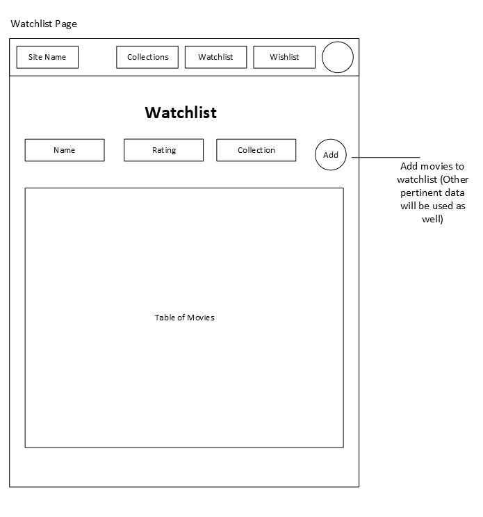

# Milestone 8
CST-339: Programming in Java III  
Justin Albecker  
3/15/2026

---

## Planning Documentation
### Initial Planning
Going into this week, I knew there were three goals I wanted to achieve:
1. Add encryption to usernames.
2. Add the Wishlist page.
3. Fix any bugs that can be found.

### Retrospective Results
This week was full of tackling projects that I put off doing in past weeks. Adding encryption to usernames was a project I intended on introducing when I implemented the Spring Security, and adding the Wishlist page was a goal of mine when creating the initial site plan. Implementing the username encryption was difficult, but manageable. Due to needing to search for accounts based on username, I had to do some workarounds to get it to work properly. The Wishlist page was an easy task, due to its similarity to the Collections page.

## Design Documentation
### General Technical Approach
My goal for the Wishlist page was similarity to the Collections page. I want the entire website to have consistent design, so adding a unique look would go against that philosophy.
### Key Technical Design Decisions
One function I wanted to ensure worked properly was the "Add to Collection" button. I wanted this function to add the movie to the collection, and removing from the wishlist. I needed this function to work flawlessly to allow users a tedious-less function that will be used often.

### Risks/Bugs Remaining
Other than small graphical errors/bugs, There are no major errors with the website's functions.
## Photos
- Screenshot of the database with encrypted username & passwords

- Screenshot of the Wishlist page and Wishlist add movie modal

### Sitemap

- Screenshot of the original Sitemap proposal

## Links

- [Video Explanation Link](https://youtu.be/z4Wc_2Rqhpo)
- [Link to Code]()

## IMPORTANT
The javadoc is located in the index file in target/site folders.